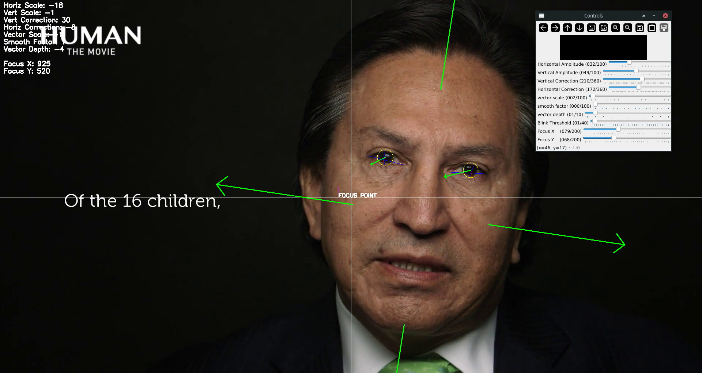

# gaze-approximation
A gaze approximation solution using mediapipe and opencv

Manual parameters
-----------------
Manual parameters are used to compensate for the lack of specific information about the shooting conditions and other necessary data for accurately calculating gaze direction. These manual parameters can be adjusted by users to fine-tune the system's performance based on the specific environment, camera setup, and individual subject characteristics.

1. Webcam or Video File: Choose between using a live feed from a webcam or analyzing a pre-recorded video file.. 
2. Manual Settings Access or Use Saved Settings: Opt for manually adjusting settings in real-time or utilize previously saved configurations to streamline the setup process.
3. Quadratic Smoothing: Apply quadratic smoothing to mitigate the compensatory effect on gaze due to head rotation, enhancing the stability and accuracy of gaze tracking.
4. Save Focus Point Coordinates: Store the x and y coordinates of the focus point in a CSV file, allowing for data analysis and record-keeping of gaze patterns over time.
5. 3D Vector Export: The 3D gaze vector can also be exported, providing a comprehensive representation of the gaze direction for further analysis or integration with other systems.

**This script is currently in development. Feedback, suggestions, and contributions are welcome and greatly appreciated.**

License
-------
This program is free software: you can redistribute it and/or modify it under the terms of the GNU General Public License as published by the Free Software Foundation.

This program is distributed in the hope that it will be useful, but WITHOUT ANY WARRANTY; without even the implied warranty of MERCHANTABILITY or FITNESS FOR A PARTICULAR PURPOSE. See the GNU General Public License for more details.

For more informations, see <https://www.gnu.org/licenses/>.
